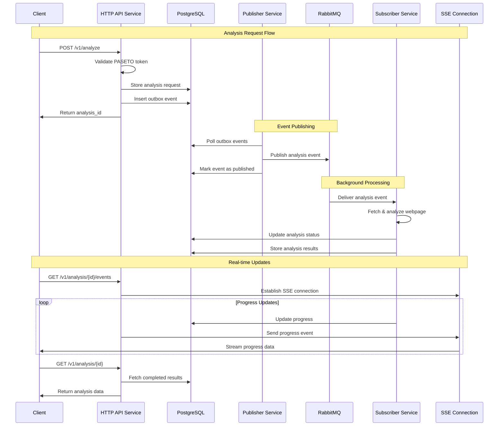
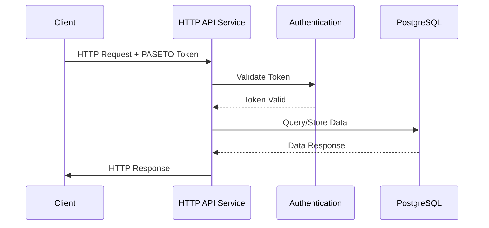
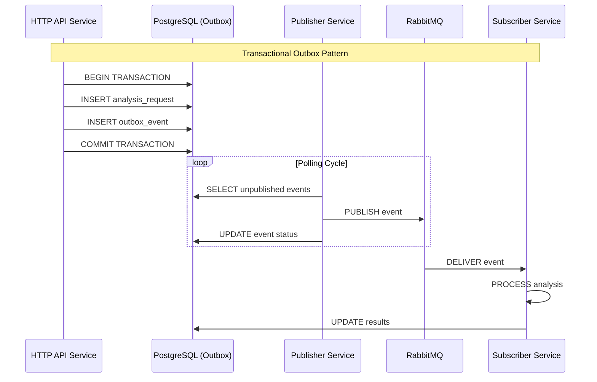
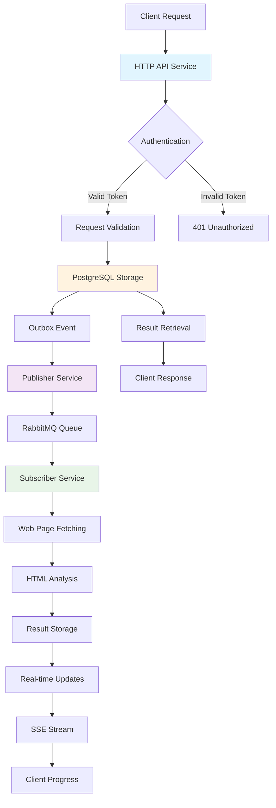
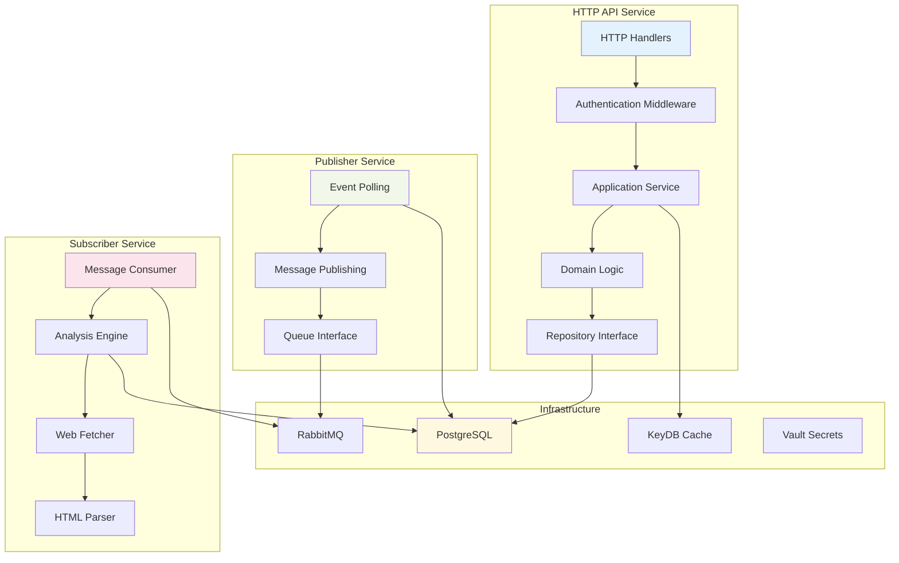

# Architecture Decision Records (ADRs)

This document captures the key architectural decisions made for the Web Analyzer project, providing context and rationale for future development.

> **Status**: Phase 1 Complete ✅ - All core backend architecture decisions have been implemented and are in production. The event-driven microservices architecture with publisher/subscriber pattern, outbox pattern, and clean architecture is fully operational.

## ADR-001: OpenAPI-First Design Approach

**Context**: Need to design a robust API with clear documentation and type safety.

### Decision
Adopt an OpenAPI-first design approach using OpenAPI 3.0.3 specification as the single source of truth for API design.

### Rationale
- **Documentation**: Always up-to-date API documentation generated from specification
- **Code Generation**: Reduces boilerplate and ensures consistency between spec and implementation
- **Validation**: Schema-based request/response validation prevents runtime errors
- **Client Generation**: Easy client library generation for API consumers
- **Developer Experience**: Clear contracts between frontend and backend teams

### Consequences
- **Positive**: Improved documentation quality, reduced development time, better API consistency
- **Negative**: Additional complexity in the build process, learning curve for OpenAPI specification.
- **Implementation**: Using oapi-codegen for Go code generation from OpenAPI specs.

## ADR-002: Go 1.25 with Modules

**Context**: Need a robust, performant backend language with good tooling.

### Decision
Use Go 1.25 with Go modules for dependency management and project structure.

### Rationale
- **Performance**: Excellent performance for web services and concurrent processing
- **Tooling**: Rich ecosystem with built-in testing, formatting, and documentation tools
- **Concurrency**: Native goroutines perfect for handling multiple analysis requests
- **Type Safety**: Strong typing prevents runtime errors in critical analysis logic
- **Deployment**: Single binary deployment simplifies containerization

### Consequences
- **Positive**: High performance, excellent concurrency, simple deployment
- **Negative**: Learning curve for developers not familiar with Go
- **Implementation**: Standard Go project layout with internal packages.

## ADR-003: Docker-based Development Environment

**Context**: Need a consistent development environment across different machines and operating systems.

### Decision
Use Docker and Docker Compose for complete development environment setup.

### Rationale
- **Consistency**: Same environment across all development machines
- **Isolation**: No conflicts with host system dependencies
- **SSL/TLS**: Local development with valid certificates using mkcert
- **Service Integration**: Easy setup of reverse proxy, cache, and documentation services
- **Production Parity**: Development environment mirrors production deployment

### Consequences
- **Positive**: Consistent environments, easy onboarding, production parity
- **Negative**: Docker overhead, complexity for simple changes
- **Implementation**: Traefik reverse proxy with SSL termination and service discovery.

## ADR-004: Traefik as Reverse Proxy

**Context**: Need a reverse proxy for local development with SSL termination and service routing.

### Decision
Use Traefik as the reverse proxy for both development and production environments.

### Rationale
- **Auto-discovery**: Automatic service discovery from Docker labels
- **SSL/TLS**: Automatic SSL certificate management with Let's Encrypt
- **Configuration**: Dynamic configuration without restarts
- **Dashboard**: Built-in monitoring and debugging interface
- **Cloud Native**: Kubernetes-ready for future scalability

### Consequences
- **Positive**: Automatic SSL, easy service routing, production-ready
- **Negative**: Additional complexity, learning curve for Traefik configuration
- **Implementation**: Docker labels for service configuration, local SSL with mkcert.

## ADR-005: Real-time Updates with Server-Sent Events

**Context**: Web page analysis takes time; users need progress updates.

### Decision
Implement real-time progress updates using Server-Sent Events (SSE).

### Rationale
- **Simplicity**: Simpler than WebSockets for unidirectional communication
- **Browser Support**: Native browser support without additional libraries
- **HTTP/2 Friendly**: Works well with HTTP/2 multiplexing
- **Firewall Friendly**: Uses standard HTTP, no special network configuration
- **Automatic Reconnection**: Browser automatically handles connection drops

### Consequences
- **Positive**: Simple implementation, good browser support, reliable delivery
- **Negative**: Unidirectional only, higher server resource usage for long connections
- **Implementation**: Dedicated SSE endpoint `/v1/analysis/{id}/events`.

## ADR-006: PASETO Token Authentication

**Context**: Need a secure authentication system for API access.

### Decision
Implement [PASETO](https://paseto.io/) (Platform Agnostic Security Token with Extended Operations) token authentication.

### Rationale
- **Security**: Enhanced security with issuer validation and expiration checks
- **Platform Agnostic**: Works across different platforms and environments
- **Stateless**: No server-side session storage required
- **Extensible**: Can be extended with additional claims as needed
- **API-Friendly**: Designed specifically for API authentication

### Consequences
- **Positive**: Strong security, scalable, API-optimized
- **Negative**: Custom implementation requires careful security review
- **Implementation**: Bearer token authentication with comprehensive validation.

## ADR-007: Modular Make-based Build System

**Context**: Need a maintainable build system that supports development workflows.

### Decision
Use Make with a modular build configuration in `build/mk/` directory.

### Rationale
- **Universality**: Available on all Unix-like systems
- **Simplicity**: Easy to understand and modify
- **Modularity**: Separate concerns into different Makefile modules
- **Documentation**: Self-documenting with `make help` target
- **Integration**: Easy integration with Docker and CI/CD pipelines

### Consequences
- **Positive**: Simple, universal, maintainable
- **Negative**: Limited compared to modern build tools, Windows compatibility issues
- **Implementation**: Modular Makefiles with the help of documentation and target organization.

## ADR-008: Cache-based Temporary Storage

**Context**: Need temporary storage for analysis results without a persistent database.

### Decision
Use KeyDB cache for temporary result storage with TTL-based cleanup.

### Rationale
- **Simplicity**: No complex database schema or migrations
- **Performance**: In-memory storage for fast retrieval
- **Automatic Cleanup**: TTL-based expiration removes old results
- **Scalability**: KeyDB clustering for horizontal scaling
- **Development**: Easy setup and maintenance

### Consequences
- **Positive**: Fast access, automatic cleanup, simple operation
- **Negative**: Results are temporary, no persistent audit trail
- **Implementation**: KeyDB with configurable TTL for analysis results.

## ADR-009: PostgreSQL for Persistent Storage with Versioning

**Context**: Need persistent storage for document data analysis with versioning capabilities to track changes over time.

### Decision
Use PostgreSQL as the primary database for storing document analysis data with built-in versioning support.

### Rationale
- **ACID Compliance**: Full transaction support ensures data integrity for critical analysis results.
- **JSON Support**: Native JSON/JSONB support perfect for storing flexible analysis data structures.
- **Versioning**: Built-in support for temporal data and versioning with PostgreSQL's row versioning.
- **Scalability**: Proven scalability with read replicas and partitioning capabilities.
- **Rich Data Types**: Support for arrays, JSON, and custom types ideal for analysis metadata.
- **Full-text Search**: Built-in full-text search capabilities for analyzed content.

### Consequences
- **Positive**: Persistent storage, data integrity, versioning support, rich querying capabilities.
- **Negative**: Additional operational complexity, backup and maintenance overhead.
- **Implementation**: PostgreSQL with JSONB columns for analysis data and temporal tables for versioning.

## ADR-010: RabbitMQ for Asynchronous Job Processing

**Context**: Need a reliable message queuing system to handle incoming analysis requests asynchronously with background job processing.

### Decision
Use RabbitMQ as the message broker for queuing incoming requests and enabling background job processing.

### Rationale
- **Reliability**: Message persistence and acknowledgment ensure no requests are lost.
- **Scalability**: Multiple workers can process jobs concurrently from the same queue.
- **Routing**: Advanced message routing capabilities for different analysis job types.
- **Dead Letter Queues**: Failed job handling with retry mechanisms and error queues.
- **Management Interface**: Built-in web management interface for monitoring and debugging.
- **Protocol Support**: AMQP standard with extensive client library ecosystem.

### Consequences
- **Positive**: Reliable job processing, horizontal scaling, fault tolerance, job prioritization.
- **Negative**: Additional infrastructure component, operational complexity, network dependency.
- **Implementation**: RabbitMQ with persistent queues and dead letter exchanges for error handling.

## ADR-011: HashiCorp Vault for Configuration and Secret Management

**Context**: Need a secure, centralized system for managing sensitive configuration data, API keys, database credentials, and application secrets.

### Decision
Use HashiCorp Vault as the centralized secret management system for secure storage and access control of all sensitive configuration data.

### Rationale
- **Security**: Industry-standard encryption and access control for sensitive data.
- **Centralized Management**: Single source of truth for all secrets across environments.
- **Dynamic Secrets**: Support for dynamic database credentials and API key rotation.
- **Audit Logging**: Complete audit trail of all secret access and modifications.
- **Integration**: Native integration with PostgreSQL, RabbitMQ, and other infrastructure components.
- **Policy-based Access**: Fine-grained access control policies for different application components.

### Consequences
- **Positive**: Enhanced security, centralized secrets management, audit capabilities, credential rotation.
- **Negative**: Additional infrastructure complexity, dependency on Vault availability, learning curve.
- **Implementation**: Vault cluster with PostgreSQL backend, integrated with application services for dynamic secret retrieval.

## System Architecture Diagrams

### Event-Driven Processing Flow

The system implements an event-driven architecture with the outbox pattern for reliable message processing:

### Service Communication Patterns

#### 1. Request-Response Pattern (Synchronous)

#### 2. Event-Driven Pattern (Asynchronous)

### Data Flow Architecture

### Component Architecture

## Future Considerations

### Potential Future ADRs
- **Signed Requests and Responses**: Enhanced security through cryptographic signing of API requests and responses for data integrity and non-repudiation.
- **Microservices Architecture**: If the application grows beyond a monolith.
- **Kubernetes Deployment**: When container orchestration is needed.
- **Monitoring and Observability**: Comprehensive monitoring strategy.
- **Circuit Breaker Pattern**: For resilient external service calls.
- **Event Sourcing**: Full event sourcing implementation for audit trails.
- **CQRS Enhancement**: Separate read/write models for scalability.
