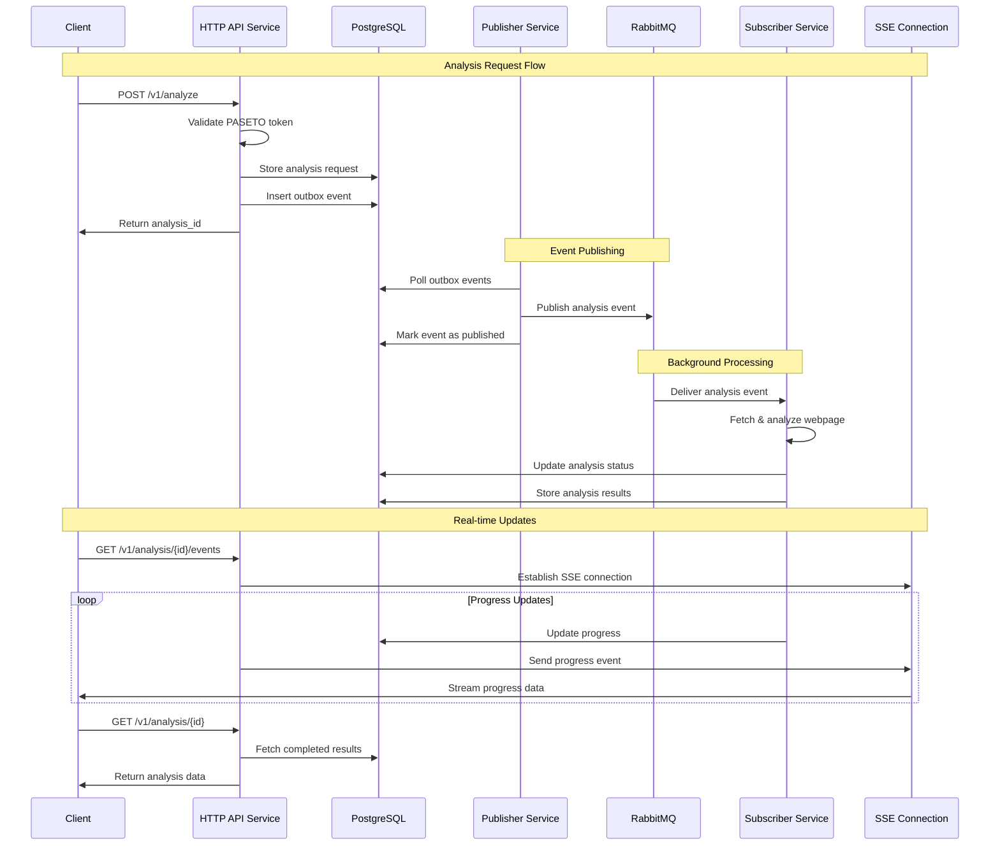
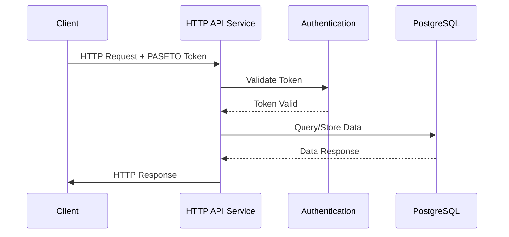
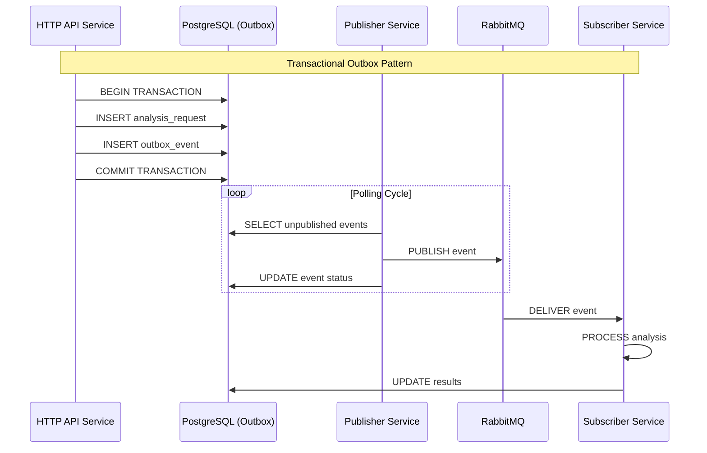
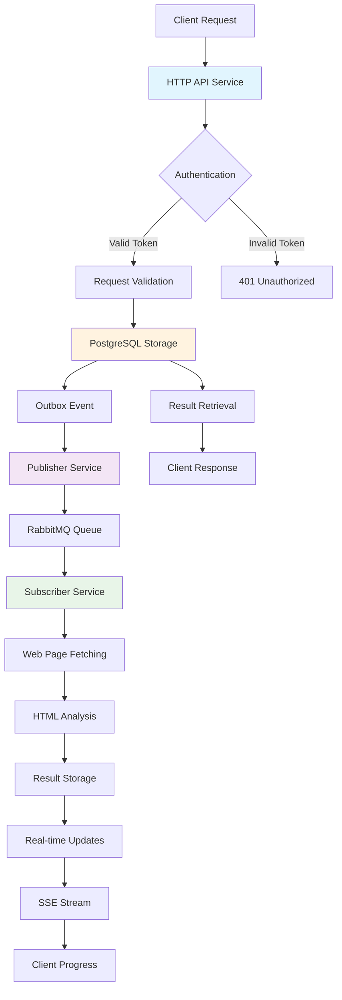
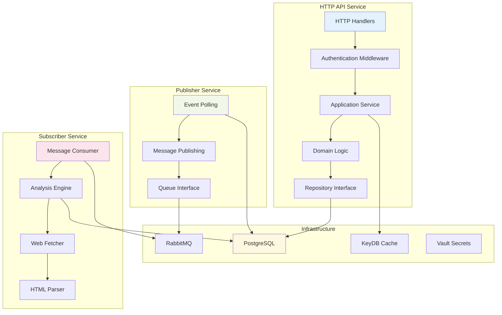

# Architecture Decision Records (ADRs)

This document captures the key architectural decisions made for the Web Analyzer project, providing context and rationale for future development.

> **Status**: Phase 1 Complete ✅ - All core backend architecture decisions have been implemented and are in production. The event-driven microservices architecture with publisher/subscriber pattern, outbox pattern, and clean architecture is fully operational.

## ADR-001: OpenAPI-First Design Approach

**Context**: Need to design a robust API with clear documentation and type safety.

### Decision
Adopt an OpenAPI-first design approach using OpenAPI 3.0.3 specification as the single source of truth for API design.

### Rationale
- **Documentation**: Always up-to-date API documentation generated from specification
- **Code Generation**: Reduces boilerplate and ensures consistency between spec and implementation
- **Validation**: Schema-based request/response validation prevents runtime errors
- **Client Generation**: Easy client library generation for API consumers
- **Developer Experience**: Clear contracts between frontend and backend teams

### Consequences
- **Positive**: Improved documentation quality, reduced development time, better API consistency
- **Negative**: Additional complexity in the build process, learning curve for OpenAPI specification.
- **Implementation**: Using oapi-codegen for Go code generation from OpenAPI specs.

## ADR-002: Go 1.25 with Modules

**Context**: Need a robust, performant backend language with good tooling.

### Decision
Use Go 1.25 with Go modules for dependency management and project structure.

### Rationale
- **Performance**: Excellent performance for web services and concurrent processing
- **Tooling**: Rich ecosystem with built-in testing, formatting, and documentation tools
- **Concurrency**: Native goroutines perfect for handling multiple analysis requests
- **Type Safety**: Strong typing prevents runtime errors in critical analysis logic
- **Deployment**: Single binary deployment simplifies containerization

### Consequences
- **Positive**: High performance, excellent concurrency, simple deployment
- **Negative**: Learning curve for developers not familiar with Go
- **Implementation**: Standard Go project layout with internal packages.

## ADR-003: Docker-based Development Environment

**Context**: Need a consistent development environment across different machines and operating systems.

### Decision
Use Docker and Docker Compose for complete development environment setup.

### Rationale
- **Consistency**: Same environment across all development machines
- **Isolation**: No conflicts with host system dependencies
- **SSL/TLS**: Local development with valid certificates using mkcert
- **Service Integration**: Easy setup of reverse proxy, cache, and documentation services
- **Production Parity**: Development environment mirrors production deployment

### Consequences
- **Positive**: Consistent environments, easy onboarding, production parity
- **Negative**: Docker overhead, complexity for simple changes
- **Implementation**: Traefik reverse proxy with SSL termination and service discovery.

## ADR-004: Traefik as Reverse Proxy

**Context**: Need a reverse proxy for local development with SSL termination and service routing.

### Decision
Use Traefik as the reverse proxy for both development and production environments.

### Rationale
- **Auto-discovery**: Automatic service discovery from Docker labels
- **SSL/TLS**: Automatic SSL certificate management with Let's Encrypt
- **Configuration**: Dynamic configuration without restarts
- **Dashboard**: Built-in monitoring and debugging interface
- **Cloud Native**: Kubernetes-ready for future scalability

### Consequences
- **Positive**: Automatic SSL, easy service routing, production-ready
- **Negative**: Additional complexity, learning curve for Traefik configuration
- **Implementation**: Docker labels for service configuration, local SSL with mkcert.

## ADR-005: Real-time Updates with Server-Sent Events

**Context**: Web page analysis takes time; users need progress updates.

### Decision
Implement real-time progress updates using Server-Sent Events (SSE).

### Rationale
- **Simplicity**: Simpler than WebSockets for unidirectional communication
- **Browser Support**: Native browser support without additional libraries
- **HTTP/2 Friendly**: Works well with HTTP/2 multiplexing
- **Firewall Friendly**: Uses standard HTTP, no special network configuration
- **Automatic Reconnection**: Browser automatically handles connection drops

### Consequences
- **Positive**: Simple implementation, good browser support, reliable delivery
- **Negative**: Unidirectional only, higher server resource usage for long connections
- **Implementation**: Dedicated SSE endpoint `/v1/analysis/{id}/events`.

## ADR-006: PASETO Token Authentication

**Context**: Need a secure authentication system for API access.

### Decision
Implement [PASETO](https://paseto.io/) (Platform Agnostic Security Token with Extended Operations) token authentication.

### Rationale
- **Security**: Enhanced security with issuer validation and expiration checks
- **Platform Agnostic**: Works across different platforms and environments
- **Stateless**: No server-side session storage required
- **Extensible**: Can be extended with additional claims as needed
- **API-Friendly**: Designed specifically for API authentication

### Consequences
- **Positive**: Strong security, scalable, API-optimized
- **Negative**: Custom implementation requires careful security review
- **Implementation**: Bearer token authentication with comprehensive validation
  - Request context propagation ensures proper cancellation, timeout, and tracing
  - Interface-based key service design enables testability and dependency inversion
  - Context-aware token validation respects request-level timeouts and deadlines

## ADR-007: UUID-based Analysis Identifiers for Security

**Context**: Need secure, unpredictable identifiers for analysis resources to prevent information leakage and unauthorized access.

### Decision
Use UUIDs (Universally Unique Identifiers) for analysis IDs instead of sequential integers or predictable identifiers.

### Rationale
- **Information Leakage Prevention**: Sequential IDs reveal business metrics (total analyses, growth rate, volume patterns)
- **Enumeration Attack Protection**: Unpredictable UUIDs prevent attackers from guessing valid analysis IDs
- **Authorization Bypass Prevention**: Random identifiers make it infeasible to access other users' analyses through ID manipulation
- **Privacy Enhancement**: Users cannot infer information about other analyses or total system usage
- **Security by Design**: Reduces attack surface without relying solely on authentication/authorization layers

### Implementation
- **Database Schema**: UUID primary keys for analysis tables
- **API Responses**: Analysis IDs returned as UUID strings in API responses
- **URL Parameters**: Analysis IDs passed as UUIDs in REST endpoints (`/v1/analysis/{analysisId}`)
- **UUID Version**: UUID v4 (random) for maximum unpredictability

### Consequences
- **Positive**: Enhanced security posture, information disclosure prevention, resistance to enumeration attacks
- **Negative**: Slightly larger storage footprint (16 bytes vs 4-8 bytes for integers), non-human-readable identifiers
- **Trade-off**: Minor storage overhead for significant security improvement

## ADR-008: Modular Make-based Build System

**Context**: Need a maintainable build system that supports development workflows.

### Decision
Use Make with a modular build configuration in `build/mk/` directory.

### Rationale
- **Universality**: Available on all Unix-like systems
- **Simplicity**: Easy to understand and modify
- **Modularity**: Separate concerns into different Makefile modules
- **Documentation**: Self-documenting with `make help` target
- **Integration**: Easy integration with Docker and CI/CD pipelines

### Consequences
- **Positive**: Simple, universal, maintainable
- **Negative**: Limited compared to modern build tools, Windows compatibility issues
- **Implementation**: Modular Makefiles with the help of documentation and target organization.

## ADR-009: Cache-based Temporary Storage

**Context**: Need temporary storage for analysis results without a persistent database.

### Decision
Use KeyDB cache for temporary result storage with TTL-based cleanup.

### Rationale
- **Simplicity**: No complex database schema or migrations
- **Performance**: In-memory storage for fast retrieval
- **Automatic Cleanup**: TTL-based expiration removes old results
- **Scalability**: KeyDB clustering for horizontal scaling
- **Development**: Easy setup and maintenance

### Consequences
- **Positive**: Fast access, automatic cleanup, simple operation
- **Negative**: Results are temporary, no persistent audit trail
- **Implementation**: KeyDB with configurable TTL for analysis results.

## ADR-010: PostgreSQL for Persistent Storage with Versioning

**Context**: Need persistent storage for document data analysis with versioning capabilities to track changes over time.

### Decision
Use PostgreSQL as the primary database for storing document analysis data with built-in versioning support.

### Rationale
- **ACID Compliance**: Full transaction support ensures data integrity for critical analysis results.
- **JSON Support**: Native JSON/JSONB support perfect for storing flexible analysis data structures.
- **Versioning**: Built-in support for temporal data and versioning with PostgreSQL's row versioning.
- **Scalability**: Proven scalability with read replicas and partitioning capabilities.
- **Rich Data Types**: Support for arrays, JSON, and custom types ideal for analysis metadata.
- **Full-text Search**: Built-in full-text search capabilities for analyzed content.

### Consequences
- **Positive**: Persistent storage, data integrity, versioning support, rich querying capabilities.
- **Negative**: Additional operational complexity, backup and maintenance overhead.
- **Implementation**: PostgreSQL with JSONB columns for analysis data and temporal tables for versioning.

## ADR-010: RabbitMQ for Asynchronous Job Processing

**Context**: Need a reliable message queuing system to handle incoming analysis requests asynchronously with background job processing.

### Decision
Use RabbitMQ as the message broker for queuing incoming requests and enabling background job processing.

### Rationale
- **Reliability**: Message persistence and acknowledgment ensure no requests are lost.
- **Scalability**: Multiple workers can process jobs concurrently from the same queue.
- **Routing**: Advanced message routing capabilities for different analysis job types.
- **Dead Letter Queues**: Failed job handling with retry mechanisms and error queues.
- **Management Interface**: Built-in web management interface for monitoring and debugging.
- **Protocol Support**: AMQP standard with extensive client library ecosystem.

### Exchange Type: Topic Exchange

The implementation uses a **topic exchange** for message routing, providing flexibility for future expansion:

- **Routing Flexibility**: Topic exchanges allow routing based on wildcard patterns in routing keys (e.g., `analysis.html.*`, `analysis.xml.*`)
- **Future Extensibility**: Add new analysis types with different routing patterns without modifying the exchange
- **Selective Consumption**: Subscribers can listen to specific message patterns (e.g., only HTML analysis vs. XML analysis)
- **Multi-tenant Support**: Routing keys can encode tenant information for isolated processing
- **Priority Handling**: Different routing patterns can map to different priority queues

**Current Implementation**: Uses `analysis.requested` routing key, but the topic exchange allows for future patterns like:
- `analysis.requested.priority` - High-priority analysis requests
- `analysis.requested.batch` - Batch processing requests
- `analysis.requested.{type}` - Type-specific analysis (html, xml, pdf, etc.)

### Consequences
- **Positive**: Reliable job processing, horizontal scaling, fault tolerance, job prioritization, flexible message routing.
- **Negative**: Additional infrastructure component, operational complexity, network dependency.
- **Implementation**: RabbitMQ with topic exchange, persistent queues, and dead letter exchanges for error handling.

## ADR-011: HashiCorp Vault for Configuration and Secret Management

**Context**: Need a secure, centralized system for managing sensitive configuration data, API keys, database credentials, and application secrets.

### Decision
Use HashiCorp Vault as the centralized secret management system for secure storage and access control of all sensitive configuration data.

### Rationale
- **Security**: Industry-standard encryption and access control for sensitive data.
- **Centralized Management**: Single source of truth for all secrets across environments.
- **Dynamic Secrets**: Support for dynamic database credentials and API key rotation.
- **Audit Logging**: Complete audit trail of all secret access and modifications.
- **Integration**: Native integration with PostgreSQL, RabbitMQ, and other infrastructure components.
- **Policy-based Access**: Fine-grained access control policies for different application components.

### Implementation
- **Vault cluster** with PostgreSQL backend, integrated with application services for dynamic secret retrieval.
- **Periodic polling** mechanism for automatic configuration updates:
  - Default 24-hour poll interval (configurable via `VAULT_POLL_INTERVAL`)
  - Version-based change detection to avoid redundant reloads
  - Automatic reload when a secret version changes in Vault
  - Combined with signal-based manual reload (SIGHUP) for immediate updates
- **Authentication methods**: Support for token-based and AppRole authentication
- **Secret versioning**: Tracks Vault secret versions to detect and apply changes

### Configuration Reload Strategy
1. **Automatic Periodic Polling**: Background ticker polls Vault at configured intervals
2. **Version Comparison**: Compares the current secret version with the last loaded version
3. **Conditional Reload**: Only reloads configuration when version changes are detected
4. **Manual Override**: SIGHUP signal triggers immediate reload regardless of version
5. **Error Handling**: Non-blocking error reporting via a dedicated error channel

### Consequences
- **Positive**: Enhanced security, centralized secrets management, audit capabilities, credential rotation, automatic configuration updates.
- **Negative**: Additional infrastructure complexity, dependency on Vault availability, learning curve.
- **Trade-off**: Periodic polling adds minimal overhead for significant operational flexibility.

## ADR-012: Hexagonal Architecture with CQRS Pattern

**Context**: Need a maintainable, testable architecture that separates business logic from infrastructure concerns and optimizes read/write operations.

### Decision
Implement hexagonal architecture (ports and adapters) with CQRS (Command Query Responsibility Segregation) pattern and decorator-based cross-cutting concerns.

### Rationale
- **Separation of Concerns**: Clear boundaries between domain logic, application services, and infrastructure
- **Testability**: Interface-based design allows easy mocking and unit testing
- **Flexibility**: Easy to swap infrastructure implementations without affecting business logic
- **CQRS Benefits**: Separate optimization of read and write operations
- **Decorator Pattern**: Clean implementation of cross-cutting concerns (logging, metrics, tracing)
- **Maintainability**: Clean code principles with early returns and minimal nesting

### Implementation
- **Ports**: Interface definitions in `internal/ports/` for repositories, services, and handlers
- **Adapters**: Concrete implementations in `internal/adapters/` for infrastructure components
- **Domain Layer**: Pure business logic in `internal/domain/` without external dependencies
- **CQRS**: Separate command and query handlers in `internal/usecases/`
- **Decorators**: Cross-cutting concerns in `internal/shared/decorators/`
- **Repository Pattern**: Multiple implementations (PostgreSQL, KeyDB, Vault)

### Consequences
- **Positive**: Highly testable, maintainable, flexible, clear separation of concerns
- **Negative**: More boilerplate code, steeper learning curve for new developers
- **Trade-off**: Increased initial complexity for long-term maintainability gains

## ADR-013: Content Hash Deduplication

**Context**: Web pages may be analyzed multiple times with identical content, leading to unnecessary processing and storage costs.

### Decision
Implement SHA-256 hash-based content deduplication to detect and avoid reanalyzing identical page content.

### Rationale
- **Performance**: Eliminates redundant analysis processing for unchanged content
- **Cost Efficiency**: Reduces storage requirements by reusing existing analysis results
- **Resource Optimization**: Saves bandwidth and processing time for identical content
- **User Experience**: Faster response times when content hasn't changed
- **Data Integrity**: SHA-256 provides reliable content fingerprinting with minimal collision risk

### Implementation
- **Database Schema**: `content_hash` column (VARCHAR 64) in the analysis table for storing SHA-256 hashes
- **Indexing**: Dedicated index `idx_analysis_content_hash` for efficient hash lookups
- **URL Normalization**: Combined with `url_normalized` for effective deduplication
- **Hash Computation**: SHA-256 hash calculated from fetched page content before analysis
- **Lookup Strategy**: Check for existing hash before processing new analysis requests

### Consequences
- **Positive**: Significant performance improvement for repeat analyses, reduced storage costs, faster user responses
- **Negative**: Additional hash computation overhead, potential edge cases with dynamic content
- **Trade-off**: Slight computational cost for hashing balanced by major savings in analysis processing

## ADR-014: Resilience and Fallback Mechanisms

**Context**: Real-time features and dynamic configuration updates may fail due to network issues, service unavailability, or infrastructure problems, requiring graceful degradation.

### Decision
Implement polling-based fallback mechanisms for both frontend real-time updates and backend configuration management to ensure system resilience.

### Rationale
- **Reliability**: Ensures functionality even when preferred mechanisms (SSE, Vault) are unavailable
- **User Experience**: Maintains seamless operation without user-visible failures
- **Operational Flexibility**: Allows system to operate with degraded infrastructure
- **Graceful Degradation**: Automatic fallback to alternative mechanisms without manual intervention
- **Zero Downtime**: Configuration updates and status monitoring continue during partial failures

### Implementation

#### Frontend Polling Fallback (Real-time Updates)
- **Primary Mechanism**: Server-Sent Events (SSE) for real-time analysis progress
- **Fallback Strategy**: Automatic polling when SSE connection fails or is unavailable
- **Trigger Conditions**: SSE connection errors, timeout failures, or unsupported environments
- **Polling Interval**: Configurable interval (default: every few seconds)
- **Seamless Transition**: Transparent fallback without user interaction required

#### Backend Polling Strategy (Configuration Updates)
- **Primary Mechanism**: Vault-based configuration with periodic polling
- **Default Poll Interval**: 24 hours (configurable via `VAULT_POLL_INTERVAL`)
- **Version-based Detection**: Only reloads when Vault secret version changes
- **Manual Override**: SIGHUP signal for immediate reload regardless of schedule
- **Error Handling**: Non-blocking error reporting continues operation during Vault unavailability

### Consequences
- **Positive**: Enhanced reliability, graceful degradation, improved user experience, operational resilience
- **Negative**: Increased server load from polling, potential delays in updates compared to push mechanisms
- **Trade-off**: Slight increase in resource usage for significant improvement in system availability and user experience

## System Architecture Diagrams

### Event-Driven Processing Flow

The system implements an event-driven architecture with the outbox pattern for reliable message processing:

### Service Communication Patterns

#### 1. Request-Response Pattern (Synchronous)

#### 2. Event-Driven Pattern (Asynchronous)

### Data Flow Architecture

### Component Architecture

## ADR-015: Testing Strategy and Framework

**Context**: Need a comprehensive testing approach that ensures code quality, maintainability, and fast feedback cycles.

### Decision
Adopt testify/assert for test assertions with parallel test execution and custom test doubles for dependency isolation.

### Rationale
- **Parallel Execution**: Tests run concurrently for faster feedback (Go's `t.Parallel()`)
- **Assertions Library**: testify/assert provides readable, expressive test assertions
- **Custom Test Doubles**: Hand-written test doubles and fakes for better control and simplicity
- **Minimal Dependencies**: Avoid heavy mocking frameworks for simpler, more maintainable tests
- **Industry Standard**: testify/assert is widely adopted with excellent documentation
- **Coverage Goals**: Support for comprehensive coverage metrics and reporting

### Implementation
- **Unit Tests**: Service layer and adapter tests with custom test doubles
- **Test Isolation**: Each test runs independently with `t.Parallel()`
- **Test Doubles**: Hand-written mocks and fakes for critical interfaces (limited use of testify/mock)
- **Table-Driven Tests**: Parameterized tests for multiple scenarios
- **Coverage Tracking**: Continuous coverage monitoring with target thresholds
- **Integration Tests**: Database integration tests with real PostgreSQL connections

### Consequences
- **Positive**: Fast test execution, maintainable tests, clear test failures, minimal framework overhead
- **Negative**: More manual work creating test doubles, potential duplication in test setup
- **Trade-off**: Slightly more test code for better control and reduced framework complexity

## ADR-016: Observability with OpenTelemetry

**Context**: Need comprehensive observability across distributed services for debugging, performance monitoring, and operational insights.

### Decision
Implement distributed tracing and metrics collection using OpenTelemetry standard.

### Rationale
- **Vendor Neutral**: Avoid lock-in to specific observability vendors
- **Industry Standard**: CNCF standard for observability instrumentation
- **Distributed Tracing**: Track requests across HTTP API, Publisher, and Subscriber services
- **Metrics Collection**: Custom metrics for business and technical insights
- **Correlation**: Trace IDs connect logs, metrics, and traces
- **Future-Proof**: Easy migration to any OpenTelemetry-compatible backend

### Implementation
- **Tracing**: Request tracing across all three services (HTTP API, Publisher, Subscriber)
- **Context Propagation**: Trace context passed through HTTP headers and message queues
- **Span Attributes**: Rich metadata for request parameters, results, and errors
- **Metrics**: Custom business metrics (analysis count, duration) and system metrics
- **Exporters**: Configurable exporters for different observability backends

### Consequences
- **Positive**: Complete request visibility, performance insights, debugging efficiency, vendor flexibility
- **Negative**: Additional complexity, performance overhead, instrumentation maintenance
- **Trade-off**: Slight performance cost for significant operational benefits

## ADR-017: Structured Logging Strategy

**Context**: Need efficient, queryable logging for debugging, monitoring, and compliance across distributed services.

### Decision
Implement structured JSON logging using zerolog for high-performance, zero-allocation logging.

### Rationale
- **Performance**: Zero-allocation design minimizes garbage collection pressure
- **Structured Format**: JSON output enables log aggregation and querying
- **Level Control**: Dynamic log level configuration per environment
- **Context Enrichment**: Automatic context fields (trace ID, service name, timestamp)
- **Cloud Native**: JSON format compatible with log aggregators (ELK, Datadog, CloudWatch)
- **Developer Experience**: Chainable API for readable log statements

### Implementation
- **Log Levels**: debug, info, warn, error with environment-based configuration
- **Correlation IDs**: Trace ID included in all log entries for request tracking
- **Contextual Fields**: Service name, version, environment automatically added
- **Error Logging**: Stack traces and error context for debugging
- **Performance**: Conditional debug logging to avoid overhead in production

### Consequences
- **Positive**: High performance, structured queries, cloud-native compatibility, efficient debugging
- **Negative**: JSON format less readable in local development, zerolog-specific API
- **Trade-off**: Raw JSON output for significant performance and query benefits

## Implementation Details

This section documents specific library and tool choices that implement the architectural decisions above.

### Go Ecosystem
- **Go Version**: 1.25 with toolchain go1.25.3
- **PostgreSQL Driver**: lib/pq for database connectivity
- **Redis Client**: go-redis for KeyDB/Redis operations
- **Configuration Parsing**: envconfig for environment variable loading
- **Code Generation**: oapi-codegen v2 for OpenAPI to Go conversion

### Testing Tools
- **Assertions Library**: testify/assert for readable test assertions
- **Test Doubles**: Custom handwritten test doubles and fakes
- **Test Runner**: Go's native test runner with parallel execution

### Observability Tools
- **Tracing**: OpenTelemetry SDK for distributed tracing
- **Logging**: zerolog for structured JSON logging
- **Metrics**: OpenTelemetry metrics for custom instrumentation

### Build and Development
- **Build Tool**: GNU Make with a modular Makefile organization
- **SSL Certificates**: mkcert for local development SSL/TLS
- **API Documentation**: Redocly CLI for OpenAPI bundling and validation
- **Hot Reload**: Air for development hot-reloading (optional)

### Infrastructure
- **Message Protocol**: AMQP 0.9.1 for RabbitMQ communication
- **Database Migrations**: Custom migration system with versioned SQL files
- **Container Runtime**: Docker Engine with Docker Compose orchestration
